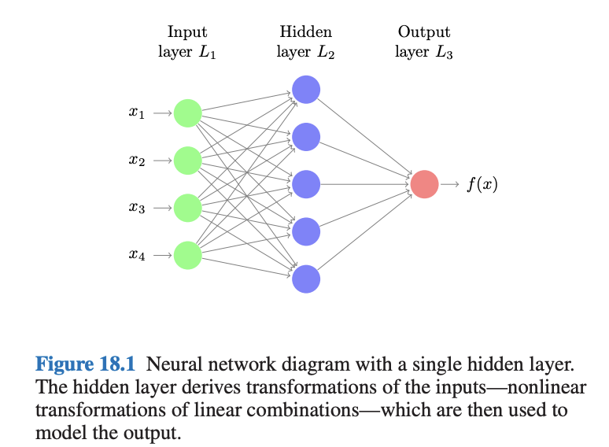
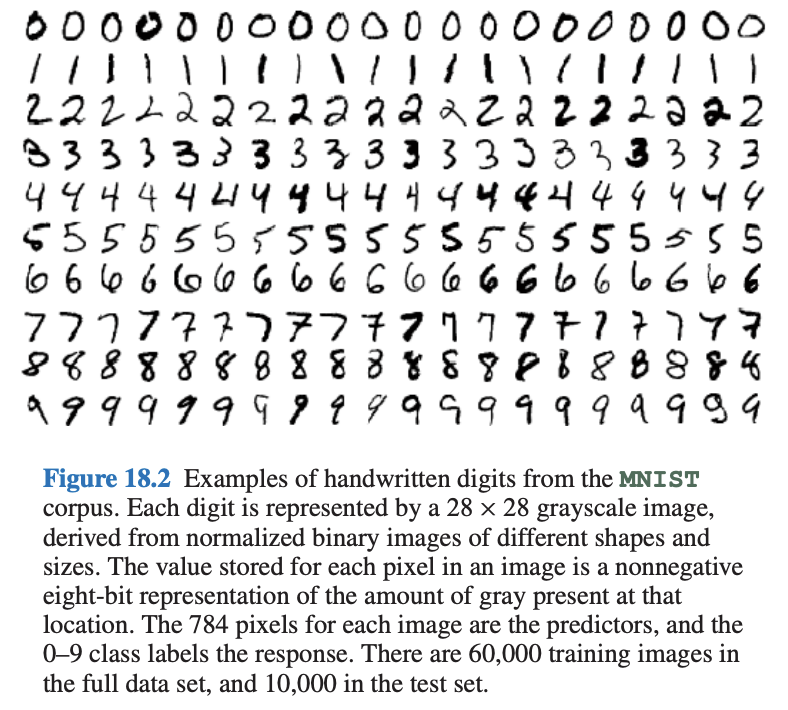
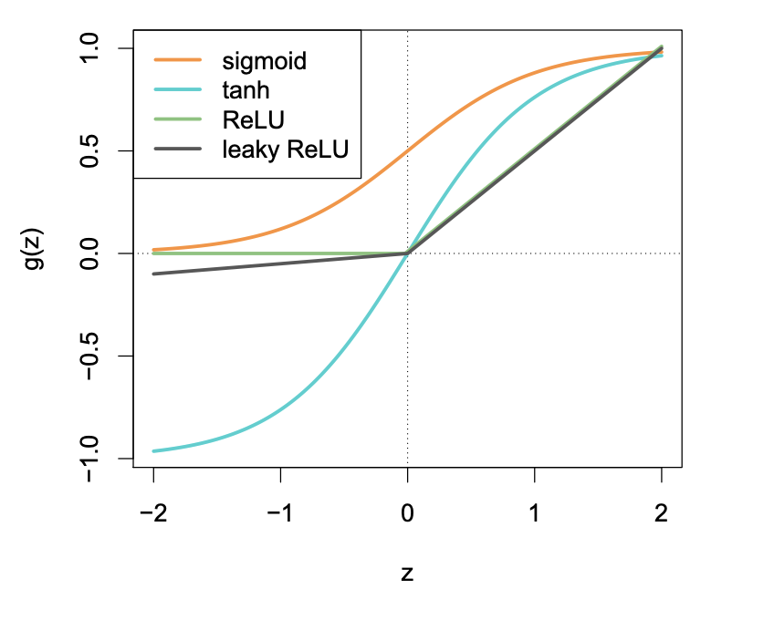
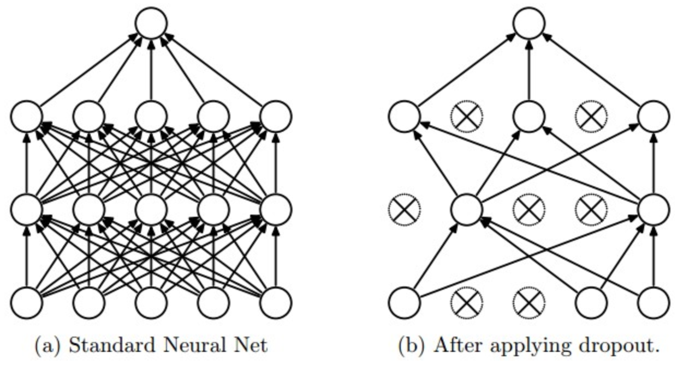
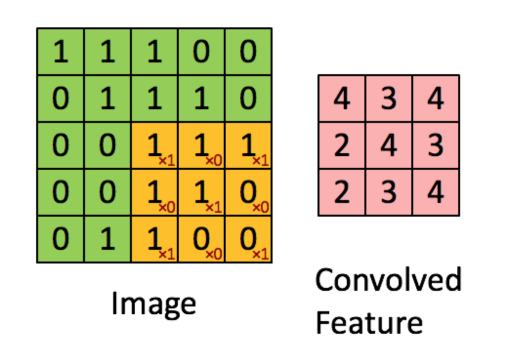
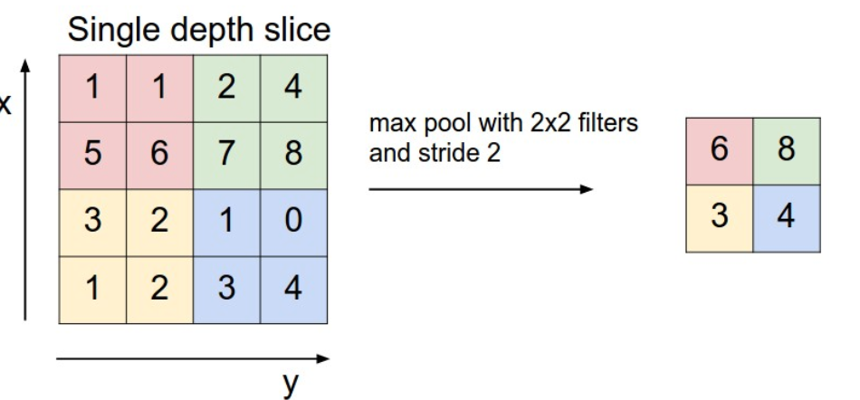

## Neural Networks and Deep Learning

- Neural networks (NNs) were introduced in 1980s
- inspired by the architecture of the human brain

```{r echo=FALSE, out.width='80%'}

```


- There are four predictors or inputs $x_j$
- hidden units: $a_l = g(w_{l0}^{(1)} + \sum_{j=1}^4 w_{lj}^{(1)} x_j)$
- output unit: $f(x) = h(w_{0}^{(2)} + \sum_{l=1}^5 w_{l}^{(2)} a_l)$

- some NN terminology
- the units are called *neurons*
- the intercepts $w_{l0}^{(1)}$ are called *bias*
- the function $g$ is a non linear function, for example sigmoid function (equivalent to the logit function)
- the function $h$ is typically the identity function for quantitative regression and a sigmoid function for binary regression.


```{r}
library(nnet)
fit <- nnet(mpg ~ wt + hp + disp + cyl, data = mtcars, size = 100)
```


## What’s the big deal?

A statistician may say: A neural network is just a slightly more complex nonlinear model, not too different from many other
generalizations of linear models.

After enjoying considerable popularity for a number of years, neural
networks were somewhat sidelined by new inventions in the mid 1990s,
such as boosting, SVMs and random forest.

Then they re-emerged with a vengeance after 2010—the
reincarnation now being called **deep learning**. 

NNs could be scaled up and generalized in a variety of way
- many hidden units in a layer
- multiple hidden layer
- weight sharing
- a variety of colorful forms of regularization (e.g., dropout layer to avoid overfitting)
- innovative learning algorithm
- most importantly, the community


## Handwritten Digit Problem

```{r echo=FALSE, out.width='70%'}

```


## Algorithms

- Backpropagation is a most common algorithm to fit a NN.
    - update the weights by using one observation / a few observations at a time
    
- Stochastic Gradient Descent Methods
    - update the weights by using a random batch of observations at a time
   
- Accelerated Gradient Methods
    - allow previous iterations to build up momentum and influence the current iteration

## Choice of Nonlinearities
There are a number of activation functions $g^{(k)}$

```{r echo=FALSE, out.width='70%'}

```

RELU: rectified linear unit


## Dropout

Dropout is a technique used to avoid overfitting on neural networks.

- This is a form of regularization that is performed when learning a network

- The idea is to randomly set a node to zero with probability $\phi$

```{r echo=FALSE, out.width='70%'}

```


# MINST

We can learn the basics of Keras by walking through a simple example: recognizing handwritten digits from the MNIST dataset. MNIST consists of 60000 28 x 28 grayscale images of handwritten digits like these:

```{r}
library(reticulate)
library(tidyverse)
library(keras)
```

If you haven't done it yet, you would need to install the python package `keras`. 
We are going to install it to the miniconda environment `r-tensorflow`. 
(It requires you to install `miniconda` as indicated in python.Rmd)

```{r, eval = FALSE}
# install R specific miniconda if you haven't
install_miniconda()
```

```{r, eval = FALSE}
# install keras into an environment if you haven't
install_keras("conda", envname = "r-tensorflow")
```

Use the environment (you might need to restart RStudio).
```{r}
use_miniconda("r-tensorflow", required = TRUE)
```


```{r}
mnist <- dataset_mnist()
```

```{r}
# a helper function to visualize the images
plot_mnist <- function(data, idx) {
  image(
    t(apply(data$x[idx, , ], 2, rev)),
    col = gray((0:255) / 255),
    main = data$y[idx],
    axes = FALSE
  )
}
```

```{r, fig.width = 2, fig.height = 2}
par(mfrow = c(5, 5), mar = c(0, 0, 0, 0))
for (i in 1:25) plot_mnist(mnist$train, i)
```

```{r}
# The data, shuffled and split between train and test sets
x_train <- mnist$train$x
y_train <- mnist$train$y
x_test <- mnist$test$x
y_test <- mnist$test$y

# convert class vectors to binary class matrices
y_train <- to_categorical(y_train, 10)
y_test <- to_categorical(y_test, 10)
```

hist(x_train[1,,])

```{r}
mnist_model <- keras_model_sequential() %>%
  layer_flatten(input_shape = c(28, 28)) %>%  # because they are images
  layer_lambda(function(x) x / 255) %>%       # scale to 0 and 1
  layer_dense(units = 256, activation = "relu") %>%
  layer_dropout(rate = 0.4) %>%
  layer_dense(units = 128, activation = "relu") %>%
  layer_dropout(rate = 0.3) %>%
  layer_dense(units = 10, activation = "softmax")
summary(mnist_model)
```


```{r}
mnist_model %>% compile(
  loss = "categorical_crossentropy",
  optimizer = optimizer_adam(),
  metrics = c("accuracy")
)
```

See https://en.wikipedia.org/wiki/Stochastic_gradient_descent for some descriptions of the optimizers.

```{r, eval = FALSE}
mnist_model %>% fit(
  x_train,
  y_train,
  epochs = 15,
  batch_size = 128,
  validation_split = 0.2
)
```


```{r, eval = FALSE}
pred <- mnist_model %>% predict_classes(x_test)
mean(pred == mnist$test$y)
wrong_idx <- which(pred != mnist$test$y)
```

```{r, fig.width = 2, fig.height = 2, eval = FALSE}
par(mfrow = c(5, 5), mar = c(0, 0, 0, 0))
for (i in seq_along(wrong_idx)) plot_mnist(mnist$test, wrong_idx[i])
```


See https://keras.rstudio.com/articles/getting_started.html for more examples


# MNIST in python

It is of course possible to run the keras model in python

```{python, eval = FALSE}
import numpy as np
from tensorflow import keras
from tensorflow.keras import layers
```

Cast the R's arrays to python numpy arrays.
```{python, eval = FALSE}
mnist = r.mnist
x_train = mnist["train"]["x"].astype("float64")
y_train = mnist["train"]["y"]
x_test = mnist["test"]["x"].astype("float64")
y_test = mnist["test"]["y"]
```

```{python, eval = FALSE}
# convert class vectors to binary class matrices
y_train = keras.utils.to_categorical(y_train, 10)
y_test = keras.utils.to_categorical(y_test, 10)
```

```{python, eval = FALSE}
model = keras.Sequential(
    [
        layers.Flatten(input_shape = [28, 28]),
        layers.Lambda(lambda x: x / 256.0),
        layers.Dense(256, activation="relu"),
        layers.Dropout(0.4),
        layers.Dense(128, activation="relu"),
        layers.Dropout(0.3),
        layers.Dense(10, activation="softmax"),
    ]
)
```


```{python, eval = FALSE}
model.compile(loss="categorical_crossentropy", optimizer="adam", metrics=["accuracy"])
```


```{python, eval = FALSE}
model.fit(x_train, y_train, batch_size=128, epochs=15, validation_split=0.2)
```

# MNIST with Convolutional Networks

## Convolutional NN

It is a special layer for handling images. CNNs consist of two special types of layers - "convolve" and "pool".

The "convolve" layer applies a bunch of filters to the images.

```{r echo=FALSE, out.width='70%'}

```

The "pool" layer is used to reduce the (filtered) image pixel sizes.
```{r echo=FALSE, out.width='70%'}

```


## Google compute engine and GPU learning

We could easily create a virtual machine with GPU support using [googleComputeEngineR](https://cloudyr.github.io/googleComputeEngineR/articles/gpu.html).

- First, go to canvas and click the Google Cloud Student Coupon Retrieval Link. You will be given $50 dollars to use any google cloud services. You may receive two emails, one for confirmation, another for redeeming the coupon. Please be careful with the email account you have logged in when you redeem the coupon. You may use either your ucd email (recommended) or a personal email.

- Go to https://console.cloud.google.com/. In the sidebar, go to "API's and Services" -> "Credentials". Click the CREATE CREDENTIALS button and choose "Service account". Create a key with JSON type and following the instruction, add "Compute Admin" and "Service Account User" roles in the step 2. Save the json file to your computer.

- Then follow the instruction of googleComputeEngineR to [setup](https://cloudyr.github.io/googleComputeEngineR/articles/installation-and-authentication.html) your account. Basically you need to tell googleComputeEngineR your project ID, select a region and the path to the JSON file.

One way to set it up is to edit the `.Renviron` file by `usethis::edit_r_environ("project")` or just `usethis::edit_r_environ()` and put down, for example

```
GCE_DEFAULT_ZONE="us-west2-b"
GCE_DEFAULT_PROJECT_ID="ucdsta141"
GCE_AUTH_FILE="service_account.json"
```

See: https://cloud.google.com/compute/docs/gpus/gpu-regions-zones for the zone

- Then you will need to increase GPUS_ALL_REGIONS as shown in
https://stackoverflow.com/a/65951365/2223504

- create your rstudio server on the remote machine with

```{r, eval = FALSE}
library(googleComputeEngineR)

vm <- gce_vm(
  template = "rstudio-gpu",
  name = "rstudio-server",
  username = "admin",
  password = askpass::askpass()
)
```

- After a few minutes, rstudio server should be available via the external ip of the machine.


The cost per hour is about $0.7, so remember to stop the machine when you are done.
```{r, eval = FALSE}
gce_vm_stop("rstudio-server")
```
Next time, when you need it, simply start it with
```{r, eval = FALSE}
gce_vm_start("rstudio-server")
```

## Demo

See: [mnist_cnn.R](mnist_cnn.R)

Reference: https://towardsdatascience.com/going-beyond-99-mnist-handwritten-digits-recognition-cfff96337392
